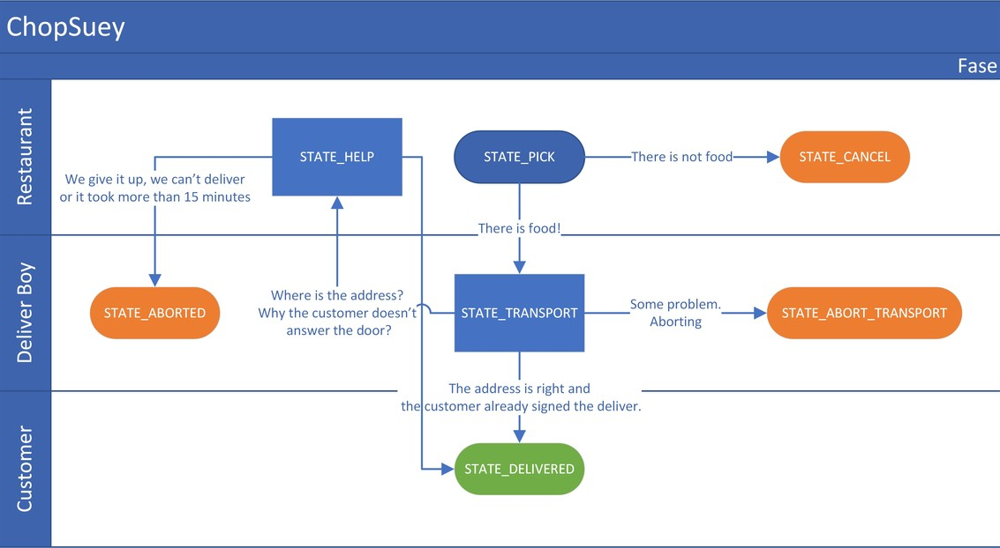
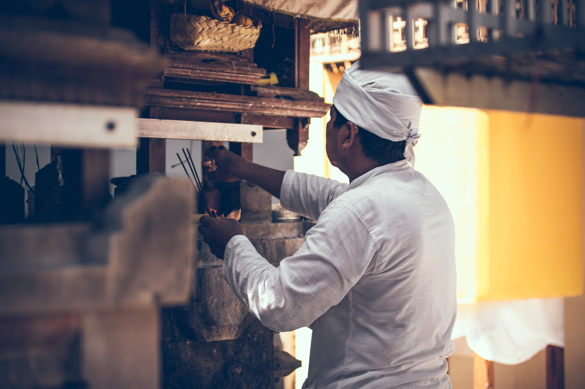
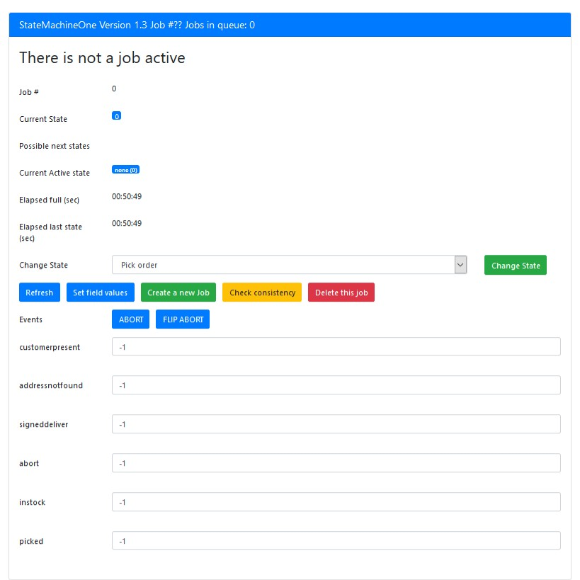

# StateMachineOne
It is State Machine library written on PHP aimed to business process.   
This library has only a simple external dependency, it is a minimalist (yet complete) library with only 3 classes.  

Since this library is PHP native, then it could run in Laravel, Symfony and any other frameworks.  


[](https://packagist.org/packages/eftec/statemachineone)
[](https://packagist.org/packages/eftec/statemachineone)
[]()
[]()
[]()
[]()
[]()
[]()

- [StateMachineOne](#statemachineone)
  - [What is a state machine?.](#what-is-a-state-machine)
  - [Notes](#notes)
  - [Example, ChopSuey Chinese Delivery Food.](#example-chopsuey-chinese-delivery-food)
    - [Fields (ChopSuey's exercise)](#fields-chopsueys-exercise)
    - [States (ChopSuey's exercise)](#states-chopsueys-exercise)
    - [Transitions (ChopSuey's exercise)](#transitions-chopsueys-exercise)
    - [Final Code (ChopSuey's example)](#final-code-chopsueys-example)
  - [Other examples](#other-examples)
  - [Transition language](#transition-language)
  - [The transition language is written with the next syntax.](#the-transition-language-is-written-with-the-next-syntax)
    - [Transition when](#transition-when)
    - [Transition set](#transition-set)
    - [Transition else](#transition-else)
    - [Transition timeout (in seconds)](#transition-timeout-in-seconds)
    - [Transition fulltimeout (in seconds)](#transition-fulltimeout-in-seconds)
  - [JOB](#job)
    - [What is a job?](#what-is-a-job)
    - [Creating a job](#creating-a-job)
    - [Running the state machine in a job](#running-the-state-machine-in-a-job)
    - [Getting a job](#getting-a-job)
    - [Database and jobs.](#database-and-jobs)
    - [Fields used in Job](#fields-used-in-job)
  - [GUI](#gui)
  - [Classes](#classes)
  - [Cache Configuration](#cache-configuration)
    - [Saving configuration](#saving-configuration)
    - [Loading configuration:](#loading-configuration)
  - [Log Format](#log-format)
    - [[info]](#info)
    - [[error]](#error)
  - [License](#license)
  - [Version](#version)
  - [What is missing](#what-is-missing)


## What is a state machine?.

A State Machine (also called **Automata**) is a procedural execution of a **job** based in **states**. 
Every job must have a single state at the same time, such as "INITIATED","PENDING","IN PROCESS" and so on,
and the job changes of state (**transition**) according to some logic or condition. Such conditions could be a field, a time or a custom function.   


The target of this library is to ease the process to create a state machine for business.  


## Notes

* **Job:** it's the process to run.  A job could have a single state at the same time.  
* **State:** it's the current condition of the job.  
* **Transition:** it's the change from one **state** to another. The transition is conditioned to a set of values, time or a function.  
  Also, every transition could have a timeout. If the timeout is reached then the transition is done, no matter the values or the conditions (even if it has the **active** state paused).  The transition could have 3 outcomes:
    * **change** The transition changes of state and the job is keep active. It is only possible to do the transition if the job has the ****active state**** = active.
    * **pause**  The transition changes of state and the job is paused. It is only possible to do the transition if the job has the **active state** = active.
    * **continue**  The transition changes of state and the job resumes of the pause. It is only possible to do the transition if the job has the **active state** = pause or active
    * **stop** The transition changes of state and the job is stopped. It is only possible to do the transition if the job has the **active state** = active or pause.
    * **stay** The transition does not change of state but it does the operations defined by the set.   
    * **stayonce** It's similar than stay but it does the operation once.   
  * **Event**: (Optional). Events are special operation that changes one or more states.
* **Active:** Every job has an **active state**. There are 4: none,stop,active,inactive,pause. It is different from the states.
  So, for example, a job could have the **state**: INPROGRESS and the **active state**: PAUSE.   
    * **none** = the job doesn't exist. It can't change of state, neither it is loaded (from the database) by default
    * **stop** = the job has stopped (finished), it could be a successful, aborted or canceled. It can't change of state neither it is loaded by default.   
    * **pause** = the job is on hold, it will not change of state (unless it is forced) but it could be continued. 
    * **active** = the job is running normally, it could change of state.
    * **inactive** = the job is scheduled to run at some date.  it couldn't change of state unless it is activated (by schedule) 
* **Refs:** Every job has some related fields.  For example, if the job is about an invoice, then refs must be the number of the invoice. The State Machine doesn't use any refs, but it keeps the values for integration with other systems.
* **Fields:** Every job has some fields or values, it could trigger a transition.

## Example, ChopSuey Chinese Delivery Food.

We need to create a process to deliver Chinese food at home. Is it easy?. Well, let's find it out.




### Fields (ChopSuey's exercise)

**Fields** are values used for out State Machine. 
In this example, I am not including other values that it could be useful (such as money, 
customer name, address and such) because they are not part or used by the state machine.

* **customerpresent** =1 if the customer is at home, 0=if not, =null not defined yet
* **addressnotfound** =1 if the address is not found by the delivery boy, =0 if found, =null if it's not yet defined.
* **signeddeliver** =1 if the customer signed the deliver, =0 if not, =null if its not defined. 
* **abort** =1 if the deliver must be aborted (for example, an accident), =0 if not.
* **instock**  =1 if the product is in stock, =0 if it's not, =null if it is not defined.
* **picked** =1 if the deliver boy picked and packed the product, =0 if not yet.

### States (ChopSuey's exercise)

It must include all the possible situation. The real world is not as easy as: sell and money.

* **STATE_PICK**  The delivery boy will pick the food if any. For example, what if a customer asks for Pekin's duck (with orange sauce) and the restaurant doesn't have?.



* **STATE_CANCEL**   The order is canceled. 
* **STATE_TRANSPORT**  The delivery boy is on route to deliver the food.


* **STATE_ABORTTRANSPORT**   Something happened, the delivery must be aborted. 
* **STATE_HELP**    The delivery boy is ready to deliver but he is not able to find the address or maybe there is nobody, so he calls for help.  
* **STATE_DELIVERED**  The food is delivered. Our hero returns to base (Chinese restaurant).


* **STATE_ABORTED**  The transaction is aborted, nobody at home or the address is wrong.

### Transitions (ChopSuey's exercise)

* **STATE_PICK** -> **STATE_CANCEL** (END)  When?. instock=0 (end of the job)
* **STATE_PICK** -> **STATE_TRANSPORT**  When?. instock=1 and picked=1
* **STATE_TRANSPORT** -> **STATE_ABORTTRANSPORT** (END)  When?. abort=1 (for some reason, our boy abort the transport, is it raining?)
* **STATE_TRANSPORT** -> **STATE_DELIVERED** (END)  When?. addressnotfound=0,customerpresent=1 and signeddeliver=1. It is delivered, the customer is present and it signed the deliver (plus a tip, I hope it)
* **STATE_TRANSPORT** -> **STATE_HELP**  When?. addressnotfound=1,customerpresent=0 and signeddeliver<>1. Our deliver calls to home and ask for new instructions. Is it Fake Street #1234 the right address?.  
* **STATE_HELP** -> **STATE_ABORTED** (END) When?. (15 minutes deadline) or if abort=1.  Our deliver called home and yes, the address is fake (it's a shocking surprise)  
* **STATE_HELP** -> **STATE_DELIVERED** (END) When?. addressnotfound=0,customerpresent=1 and signeddeliver=1. It is delivered, the customer is present and it signed the deliver (plus a tip, I hope it)  

### Final Code (ChopSuey's example)
[Example/ChopSuey.php](example/ChopSuey.php)

## Other examples

[Example/BuyMilk.php](example/BuyMilk.php) (buy milk)

[Example/Car.php](example/Car.php) (car parking)

```php
<?php
use eftec\statemachineone\StateMachineOne;

include "vendor/autoload.php";

define("STATE_PICK",1);
define("STATE_CANCEL",2);
define("STATE_TRANSPORT",3);
define("STATE_ABORTTRANSPORT",4);
define("STATE_TODELIVER",5);
define("STATE_HELP",6);
define("STATE_DELIVERED",7);
define("STATE_ABORTED",8);

$smachine=new StateMachineOne();
$smachine->setDebug(true);
$smachine->tableJobs="chopsuey_jobs";
$smachine->tableJobLogs="chopsuey_logs";

$smachine->setDefaultInitState(STATE_PICK);
$smachine->setAutoGarbage(false); // we don't want to delete automatically a stopped job.
$smachine->setStates([STATE_PICK=>'Pick order'
	,STATE_CANCEL=>'Cancel order'
	,STATE_TRANSPORT=>'Transport order'
	,STATE_ABORTTRANSPORT=>'Abort the delivery'
	,STATE_TODELIVER=>'Pending to deliver'
	,STATE_HELP=>'Request assistance'
	,STATE_DELIVERED=>'Delivered'
	,STATE_ABORTED=>'Aborted']);

$smachine->fieldDefault=[
	'customerpresent'=>-1
	,'addressnotfound'=>-1
	,'signeddeliver'=>-1
	,'abort'=>-1
	,'instock'=>-1
	,'picked'=>-1
	,'message'=>''];
$smachine->setDB('mysql','localhost',"root","abc.123","statemachinedb");
$smachine->createDbTable(false); // you don't need to create this table every time.

$smachine->loadDBAllJob(); // we load all jobs, including finished ones.

// business rules
$smachine->addTransition(STATE_PICK,STATE_PICK
	,'when instock = 0 set message="without stock"','stay'); // it stays in the same state
$smachine->addTransition(STATE_PICK,STATE_CANCEL
	,'when instock = 0 set abort = 1','stop'); // ends the process
$smachine->addTransition(STATE_PICK,STATE_TRANSPORT
	,'when instock = 1','change'); // changes transition
$smachine->addTransition(STATE_TRANSPORT,STATE_ABORTTRANSPORT
	,'when abort = 1','stop'); // ends the process
$smachine->addTransition(STATE_TRANSPORT,STATE_DELIVERED
	,'when addressnotfound = 0 and customerpresent = 1 and signeddeliver = 1 timeout 3600','stop'); // 1 hour max.
$smachine->addTransition(STATE_TRANSPORT,STATE_HELP
	,'when addressnotfound = 1 or customerpresent = 0 timeout 3600','change'); // 1 hour max
$smachine->addTransition(STATE_HELP,STATE_ABORTED
	,'when wait timeout 900','change'); // it waits 15 minutes max.
$smachine->addTransition(STATE_HELP,STATE_DELIVERED
	,'when addressnotfound = 0 and customerpresent = 1 and signeddeliver = 1','change');


$msg=$smachine->fetchUI();
$smachine->checkAllJobs();

$smachine->viewUI(null,$msg); // null means it takes the current job
```


## Transition language

Let's say the next transition

```php
$smachine->addTransition(STATE_PICK,STATE_CANCEL
	,'when instock = 0 set abort = 1','stop');

```

The transition is written as follow:
* initial state (or initial states)
* end state
* Transition language
* outcome, it could be **change** (default value),**stop**,**pause**, **continue** and **stay**
    * **change** means the state will change from **initial state** to **end state** if it meets the condition (or timeout).  It will only change if the state is active.  
    * **stop** means the state will change and the job will stop (end of the job)  
    * **pause** it means the state will change and the job will pause.  A job paused can't change of state, even if it meets the condition.  
    * **continue** it means the state will change and the job will continue from pause.
    * **stay** it means the state will not change (but it executes any other instruction if any).  

## The transition language is written with the next syntax.
```php
"_when_ var1 = var2 and var3 = var4 or var4 = var5"
"_set_ var1 = var2 , var3 = var4"
"_timeout_ var1"
"_fulltimeout_ var2"
```

* there are three operations we could do **when** and/or **set** and/or **else**

### Transition when
It adds a condition so where the transition must be done. For example:  

```php
$smachine->addTransition(STATE_ONE,STATE_TWO,'when field = 0');
```

In this case, the state changes from STATE_ONE to STATE_TWO when field is zero.

It could also exist multiple initial states

```php
$smachine->addTransition([STATE_ONE,STATE_EXTRA],STATE_TWO,'when field = 0');
// its the same than to add multiples transitions:
// $smachine->addTransition(STATE_ONE,STATE_TWO,'when field = 0');
// $smachine->addTransition(STATE_EXTRA,STATE_TWO,'when field = 0');
```


Types of transition:

```php
"when field=0"  // it happens when the field is zero.   
"when $var='hi'" // it happens when the global variable is 'hi'   
"when fn()=44" // the transition is triggered when the function fn() returns 44  
"when always" // its always true. It is the same than "when 1=1". The transition is always executed
```

It compares a constant. The binary operator for comparison are
* = Equals
* **&lt;&gt;** Not equals
* **&lt; &lt;=** Less and less than
* **&gt; &gt;=** Great and great than
* **contain** If a text contains other.
```php
"when field contain 'text'"
```

Values of the field could be as the next ones:
* **field** = it is a field of the job.
```php
"when field = field2"  // when field (of the job) is equals to field2
```

* **_idjob** = it is the number of the current job. It is calculated every time the job is evaluated
```php
"when id=_idjob"
```

* **$var** = it is a global variable of PHP.  Take note that 
```php
$v1=20;
$smachine->addTransition(S1,S2,"when $v1=1"); // WRONG: the variable v1 is evaluated when it is defined, i.e equals to write "when 20=1"
$smachine->addTransition(S1,S2,"when \$v1=1"); // RIGHT: the variable v1 is evaluated when the transition is checked
$smachine->addTransition(S1,S2,'when $v1=1'); // RIGHT:(') the variable v1 is evaluated when the transition is checked
```

* **777** = it is a numeric constant
```php
"when field = 777" // when field is equals to 777
```


* **"AAA"**, **'aaa'** = it is a literal     
  when field = 'hello' // when field is equals to the text hello

* **function()** = it is a global function. Every function must have the parameter $job.
```php
"when field = somefunc()" // function somefunc(Job $job) {...} 
```

* **null()** it is the null value
```php
"when field = null() "
```

* **true()** it is the true value (true)
```php
"when field = true()" // when field is equals to true
```

* **false()** it is the false value (false)
```php
"when field = true()"  // when field is equals to false
```


> * **on()** it is the on value (1)  
>
> * **off()** it is the off value (0)  
>
> * **undef()** it is the undefined value (-1)  
>
> * **flip()** indicates that the value will be flipped (1=>0 and 0=>1). Example (x=1) x = flip(), now (x=0). If the value is not zero, then it's flipped to zero.    

```php
"set field=flip()" // it is only valid for set.
```


* **now()** it defines the current timestamp (in seconds)
* **interval()** it returns the current interval between now and the last state.
* **fullinterval()** it returns the current interval between now and the start of the job.
* **timestate()** it returns the time elapsed of the current state.

#### For example  

```php
$smachine=new StateMachineOne();
function someFunction($job) {
    // we could do something here we should return a value
    return 0;
}
$var=222;
$smachine->fieldDefault=[
	'field2'=>0
	,'field3'=>0
	,'field4'=>0];
$smachine->addTransition(STATE_ONE,STATE_TWO
                         ,'when field2 = 2 and field3 > someFunction() and  field4=$var');

```

### Transition set

We could add an operation of change of variables when a transition is done.

```php
$smachine->addTransition(STATE_ONE,STATE_TWO,'when field = 0 set field=1');
```

In this case, when we are in STATE_ONE and field=0, then we change to state STATE_TWO and we assign the field=1

Examples:

```php
"set field = 0 , field2 = 3"
```

It sets a field of the job.

* The first value of the operation can't be a constant. 
```php
"set 0 = 20"  // is invalid
```

* We also could set a function.
```php
"set myfunc() = 20"  
```

> Where the function (global) must be defined as myfunc(Job $job,$input) {}
* The first value could be a field or a (global) variable

```php
"set field=20"  
"set $variable=20"  

"set field = 0"  
```

It sets the field to the value 0

```php
"set field + 1"
```

It increases the value of field by 1 (field=field+1)

```php
"set field - 1"
```

It decreases the value of field by 1 (field=field-1)

### Transition else

It works similar than "set" but it is executed when the transition is not done.

```php
$smachine->addTransition(STATE_ONE,STATE_TWO,'when field = 0 set field2="done" else field2="not done"');
```

In this case, it sets the field2="not done" until the transition is done. 

> **Note:** This operation is called every time the expression is evaluated. So it could be evaluated many times.

### Transition timeout (in seconds)

```php
$smachine->addTransition(STATE_ONE,STATE_TWO,'when field = 0 timeout 3600');
```

The state chances from STATE_ONE to STATE_TWO when the field is zero, or has elapsed 3600 seconds elapsed in the STATE_ONE.

It sets the timeout between the time of current state and the current time.
If a timeout happens, then the transition is executed.

```php
"timeout 3600"   // 1 hour timeout  
"timeout field" // timeout by field, it is calculated each time.
```

  

### Transition fulltimeout (in seconds)

```php
$smachine->addTransition(STATE_ONE,STATE_TWO,'when field = 0 fulltimeout  3600');
```

The state chances from STATE_ONE to STATE_TWO when the field is zero, or has elapsed (since the start of the job) 3600 seconds.

It sets the timeout between the time of initial state and the current time.
If a timeout happens, then the transition is executed.

```php
"fulltimeout 3600"   // 1 hour timeout  
"fulltimeout field" // timeout by field, the field is evaluated each time.    
```

## JOB

### What is a job?

Let's say we have a blueprint to build the house. The **job** is the action to build the house and the blueprint is the **transitions**.   So, the job is an operative part of our work-flow.

A **job** keeps values, including the current **state** and it has a lifecycle, while the workflow (the transitions) doesn't keep any single value. It is possible to create a short life job that works in a single web thread. However, if we need to keep the values, then we could use a database or a file system (flat file).  

### Creating a job

There are several ways to create a job.   One of them is using the GUI and other is via code.  

Creating a job via code

```php
// $smachine is our state machine with transitions, events and such.
$job=$smachine->createJob(['value1'=>'hi','value2'=>'world']); // we create a job with the values value1 and value2
// or we could create the job the with the default values
$job=$smachine->createJob();

$smachine->checkJob($job); // then we executed the job.

var_dump($job->state); // the id of the current state. 
var_dump($job->fields); // And we could see the result of the job
```

### Running the state machine in a job

```php
$smachine->checkJob($job); // then we executed the job.
$smachine->checkAllJob(); // We execute all jobs stored in our state machine.

```

### Getting a job

```php
$smachine->getLastJob(); // we load the last job (if we already has a job into a memory);
$smachine->getJob($idJob); // we get a job from the queue.
$smachine->getJob($idJob); // we get a job from the queue.
$smachine->getJobQueue(); // we get all the jobs from the queue
$smachine->loadDbJob($idJob); // we read a job with the id $idJob and we store into the queue
$smachine->loadDbAllJob(); // We load all jobs (including inactive jobs) from the database and we store into the queue
$smachine->loadDBActiveJobs(); // We load all active jobs from the database and we store into the queue.
```


### Database and jobs.

```php
$smachine->loadDbJob($idJob); // we read a job with the id $idJob
$smachine->loadDbAllJob(); // We load all jobs (including inactive jobs) from the database.
$smachine->loadDBActiveJobs(); // We load all active jobs from the database.
$smachine->saveDBAllJob(); // we save all the jobs in memory.
$smachine->saveDBJob($job); // we save a specific job.
$smachine->saveDBJobLog($job,$texto); // we save a log of a job.
$smachine->deleteJobDB($job); // we delete a specific job.

```


### Fields used in Job

* **$idJob** int number or position of the job on the queue
* **$idParentJob** int|null the number of the parent job
* **$dateInit** int initial date (timestamp)
* **$dateLastChange** int date of the last change (timestamp)
* **$dateEnd** int date of end (timestamp)
* **$dateExpired**  int date of expiration (timestamp)
* **$state** string|int the id of the current state
* **$fields** array fields or values per job. It must be an associative array
* **$stateFlow**  array indicates the flow of states
* **$transitions** bool[] it is used to determine if transition was already executed
* **$isNew** bool If the job is new or not. It is used to store into the database (insert)
* **$isUpdate** bool If the job is updated. It is used to store into the database (update)
* **$log**  string[]


## GUI

This library has a build-in GUI for testing.




## Classes
[StateMachineOne](StateMachineOne.md) It is the main class.
[Job](Job.md) It is the model class for the job  
[Transition](Transition.md) It is the model class for the transitions.  

## Cache Configuration

It is possible to cache all the configurations.

### Saving configuration

```php
$stateMachine=new StateMachineOne();
// configuration goes here.
file_put_contents("mycode.php", "<?php\n".$stateMachine->cacheMachine("FumMachineCache"));  
```

### Loading configuration:

```php
$stateMachine=new StateMachineOne();
include 'mycode.php';
FumMachineCache($stateMachine);
```

## Log Format

Commonly, the log format could be of the type info or error.   Flag could show a different type.

### [info]


> state,,changed,,Parked,,1,,Idling,,2,,0,,change

* state = verb of the operation.

* changed = the operation executed. It could be changed,stop,continue

* Parked = the first state (before the change)

* 1 = the number of the first state (before the change)

* Idling = the state it changed.

* 2 = the number of the state it changed.

* 0 = the transaction that triggered the change.

* change = the description of the change.

### [error]


> state,,transition,,text,,1,,message  // when a check of the job fails

> savejob,,message // when to save a job fails.

> changestate,,idjob,,idstate,newstate // when the change of a state fails


## License

Dual license (LGPL 3.0 and Commercial). See LICENSE file.

## Version


* 2.14 2021-09-17

  * added duringState() that allows to do one operation while the job is in some state.
  * added internal function timestate() that returns the current time of the current state (of the current job).
* 2.13 2021-07-03
  * addTransition() now allows multiple initial states. 
  * Updated dependencies in composer.json 
* 2.12 2021-01-16
  * Some cleanups of the code.  
  * Updated dependencies.
* 2.11 2020-10-16
  * Jobs has an extra field called idParentJob.   *Job tables must be rebuild* or added the column: idparentjob int.     
* 2.10.1 2020-10-15
  * A small bug in saveDbJob where the $backup field is null and we are updating.
* 2.10 2020-10-15 
   * Logs now are separated by ,, instead of |. It is because some message could uses "|"
   * Log state, we added the number of transaction.  
* saveDbJob(): Update in the database: The library doesn't update fields that aren't changed. For this,  it creates a backup variable every time a job is loaded and it compares the backup with the job to save.
* 2.9.2 2020-09-29 saveDbJob() updated the primary key field. Now, it skips to update it.
* 2.9.1 2020-09-22 cacheMachine() now works correctly.
* 2.9 2020-09-20 The flags are visualized differently. Also the serialization of text_job now use serialize instead
 of JSON.  Previous jobs must be flushed, you can flush with $stateMachine->createDbTable(false);   
* 2.8 2020-09-15 added the field $fieldUI to specify visual components.   
* 2.7 2020-08-11 a small update of dependencies.
* 2.6 2020-04-23
    * Slimming down the installation. Now "Docs" is not included in the installation  
* 2.5 2020-04-13  
    * updating dependency **eftec/pdoone** 1.15 to 1.32.1  
    * updating dependency **etec/minilang** 2.14 to 2.15  
* 2.4 2019-12-26
    * Service Object now works on events.
    * Updated library eftec/PdoOne to 1.15
* 2.3 2019-12-26
    * Method Createdbtable() now sets a valid default value
    * Some cleanups.
    * Bootstrap updated to 4.4.1. Also it is using https instead of http
* 2.2 2019-10-22
    * Updated eftec/MiniLang (dependency) from 2.9 => 2.12
    * Updated eftec/pdoone (depe
    ndency) from 1.11 => 1.12
    * Added dependency/documentstoreone (dependency) to 1.11 (it allows to use the filesystem as database)
    * New methods setDocOne(), getDocOne()
    * Now the library allows to use pdo (mysql database) or a file system (documentOne) for the persistence.
    * Fixed a problem with the UI (it only executed the last job)
    * Added changes to the UI. Now, it is possible to view and change the current job.
    * Fixed a problem with the creation of table. Now the column TEXT_JOB is always created.
* 2.1 2019-08-28
    * Updated eftec/minilang to 2.9. 
    * It allows to store arrays in each field
    * If the job's field is an object or array, then it is store in a MEDIUMTEXT FIELD (serialized)
    * method Flags::flagexist()
    * method StateMachineOne::removetransition()
* 2.0 2019-08-24 
    * Changed the flags. The definition of push is flipped. After push('msg','id'..) now push('id','msg'..)
    * Added method to set the time.
* 1.12 2019-08-16
    * Updated MiniLang
    * Added method viewJson()
    * Now event doesn't crash if the job is null.
    * CreateColTable() (private method) is removed.
    * Flag() now has expiration (optional)
* 1.11 2019-08-04 Some fixes.
* 1.10 2019-08-04
    * Updated to "eftec/minilang": "^2.7"
    * Solved a bug in callEvent() does not fail if there is not a job.
    * Added the method cacheMachine() to cache the results.
    * Code Formatted to PSR-2
* 1.9 2019-08-03 
    * Some fixes. Now the UI doesn't show events that "stay" in the same state. 
    * Now it uses eftec/minilang 2.6 that permits the use of "else"
    * The UI is more reduced. 
    * Method createColsTable() added.        
* 1.8 2019-07-29 Some cleanups and methods setPdoOne() and getPdoOne();
* 1.7 2019-06-16 Lots of changes.
* 1.6 2018-12-26 Now MiniLang is a separate dependency.   
* 1.5 2018-12-23 Xmas update (btw porca miseria).     
    * Now the language is parsed differently.  The space is not mandatory anymore.   
    * "when timeout" is not deprecated. Now it is called as "when always"    
* 1.4 2018-12-12 
    * Some fixes.  
* 1.3 2018-12-11 
    * Added addEvent() and callEvent()   
    * Added timeout and fulltimeout to the transition language  
    * Now transitions doesn't require the timeout.  
    * idRef are not longer used.    
* 1.2 2018-12-09 Updated dependency  
* 1.1 2018-12-09 Some corrections.  
* 1.0 2018-12-08 First (non beta) version.

## What is missing

* ~~events and timeout~~
* Most unit test, ~~now it is only the barebone.~~ the unit test is real but it's still basic. 
* Increase the log features.  